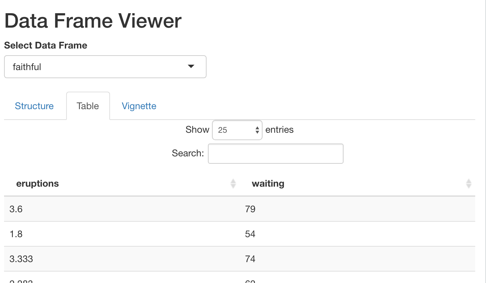

```{r, include = FALSE}
knitr::opts_chunk$set(
  collapse = TRUE,
  comment = "#>"
)
```

```{r setup}
library(ShinyDemo)
```

[Shiny](https://shiny.rstudio.com) applications have become a very popular and powerful way of creating interactive we applications that leverage the power of R. There are numerous ways Shiny apps can be deployed including [ShinyApps.io](https://www.shinyapps.io) or hosted services such as DigitalOcean or Amazon AWS. The [Golem](https://github.com/ThinkR-open/golem) project provides a framework for developing Shiny apps as R packages. However, with Golem, the Shiny app is the primary product. This package provides a framework for including Shiny apps where the app is designed to demonstrate the features of the package. That is, it is more like the role R package demos had before they were obfuscated by package vignettes and tests (via the [`usethis`](https://usethis.r-lib.org) package. The primary function used by package users is `shiny_demo`. Much like the built in `demo()` function, calling `shiny_demo()` without any parameters will list available Shiny demo apps in all the loaded packages. Calling `shiny_demo(topic)` will launch the Shiny app. In addition to providing a standardized structure for including Shiny demo apps within your package, it also provides functionality to allow the package user to pass parameters to the Shiny app.

For the package developer, Shiny demo apps need to be placed in the `inst/shiny` folder. The `ShinyDemo::shiny_demo()` function will automatically find apps located there. The files placed in this file are the same as building a standalone Shiny app (i.e. you can use the `globa.R`, `shiny.R`, and `ui.R` files or the single `app.R` file). Supporting files should also be placed here (e.g. `www/`, `R/`, etc.). Consider the following Shiny app that displays information about data frames.

The `ui.R` file:

```{r, eval=FALSE}
fluidPage(
	titlePanel("Data Frame Viewer"),
	uiOutput('df_select'),
	tabsetPanel(
		tabPanel(
			'Structure',
			verbatimTextOutput('df_structure')
		),
		tabPanel(
			'Table',
			dataTableOutput('df_table')
		)
	)
)
```

The `server.R` file:

```{r, eval=FALSE}
function(input, output, session) {
	get_data <- reactive({
		req(input$dataframe)
		df <- NULL
		if(exists(input$dataframe)) {
			df <- get(input$dataframe)
		}
		return(df)
	})
	
	output$df_select <- renderUI({
		ls_out <- ShinyDemo::ls_all()
		dfs <- character()
		for(i in ls_out) {
			if(is.data.frame(get(i))) {
				dfs <- c(dfs, i)
			}
		}
		if(length(dfs) > 0) {
			selectInput('dataframe', 'Select Data Frame', choices = dfs)
		} else {
			p('No data.frames found!')
		}
	})
	
	output$df_structure <- renderPrint({
		df <- get_data()
		str(df)
	})
	
	output$df_table <- renderDataTable({
		df <- get_data()
		return(df)
	})
}
```

This application will run as is but very likely will not list any data frames to view (assuming run from a fresh R session). If you want to provide data frame to view to the end user, you could load the data frame in `global.R`, for example. The `ls_all()` function work like `ls()`, except it will traverse the environment chain up to `.GlobalEnv`. This Shiny app is included in the `ShinyDemo` package and can be launched using the follow command:

```{r, eval=FALSE}
shiny_demo('df_viewer')
```

A is this application is not very useful. However, we can call the `shiny_demo` with any arbitrary list of parameter (note they must be named) that will be passed to the Shiny application. The following command will make the `mtccar` and `faithful` data frame available to the end user.

```{r, eval=FALSE}
shiny_demo('df_viewer',
           mtcars = mtcars,
           faithful = faithful)
```



If you wish to run a Shiny app with parameter outside the `inst/shiny` directory, the `run_shiny_app()` function is a wrapper to `shiny::shinyApp()` and `shiny::runApp()` to run a Shiny app from a directory or to pass the server and ui function directly, respectively. For example:

```{r, eval=FALSE}
run_shiny_app(paste0(find.package('ShinyDemo'), '/shiny/df_viewer'),
              mtcars = mtcars,
              faithful = faithful)
```

Will work exactly the same as above. If the `server` and `ui` function are defined, the following also works:

```{r, eval = FALSE}
run_shiny_app(ui = ShinyDemo::df_viewer_ui,
              server = ShinyDemo::df_viewer_server,
              mtcars = mtcar,
              faithful = faithful)
```

### Utility Functions

The `ShinyDemo` has a few utility functions.

#### `ls_all()`

The `ls_all()` function works like `ls()` in that it returns a character vector listing the names of objects available, however `ls_all()` will traverse the environment chain until it reaches the `.GlobalEnv`. 

#### `renderRmd`

This will render an R markdown file from a Shiny application. If the `input` parameter is provided it will be available within the R markdown file at render time. 

#### `includeVignette`

This works like `includeMarkdown` except it will include an HTML vignette within the Shiny app. 

#### `renderVignette`

Similar to `includeVignette` except the source R markdown for the vignette will be rendered instead of using the prebuilt vignette from the package directory. This avoids some potential formatting issues of `includeVignette` since it will render the document as a partial HTML file (i.e. the `<head></head>` content will be excluded).


